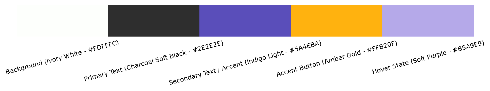
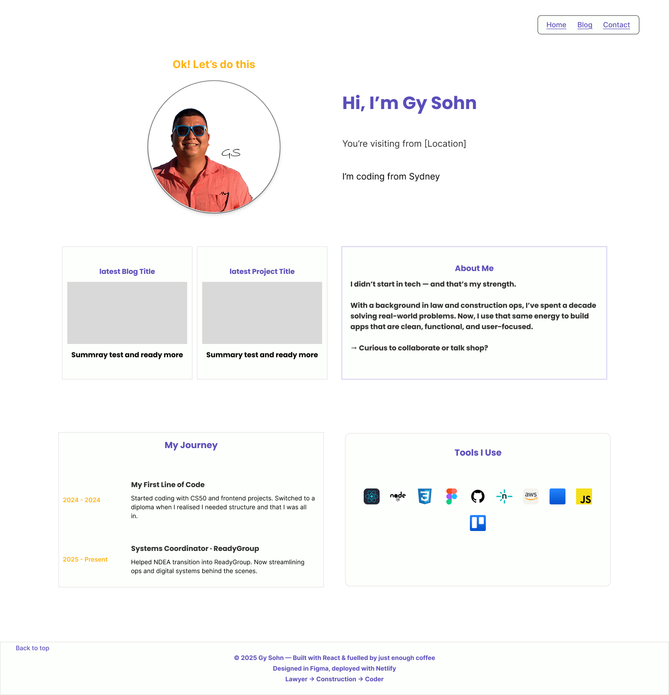
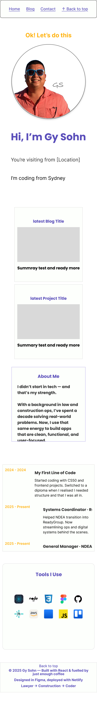
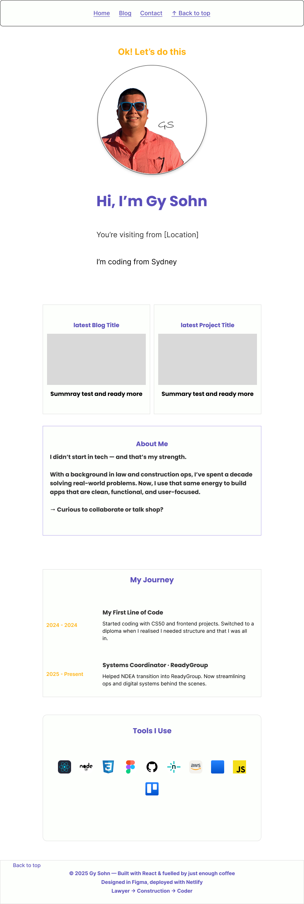
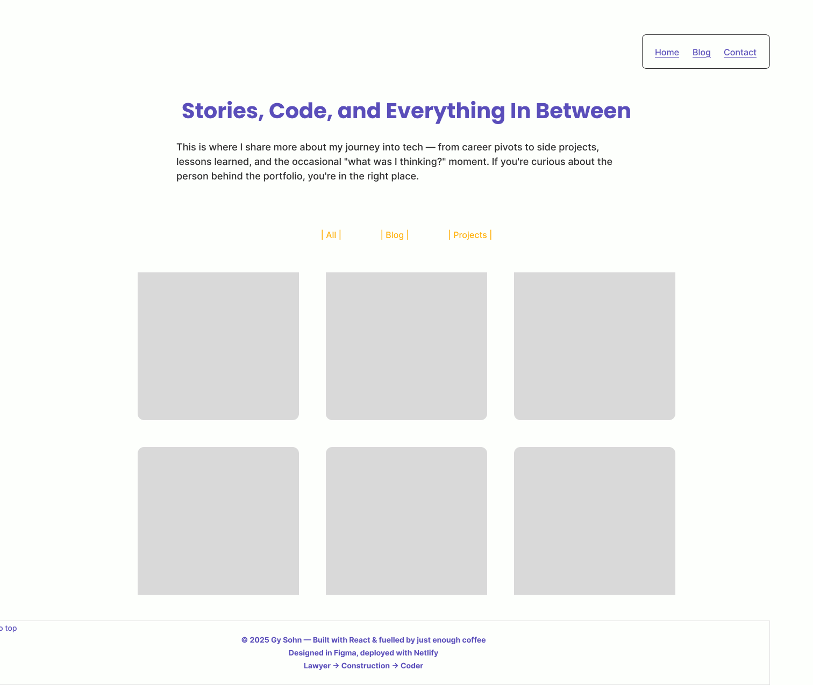
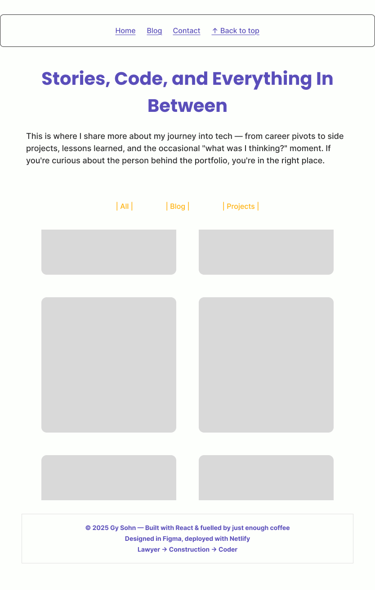
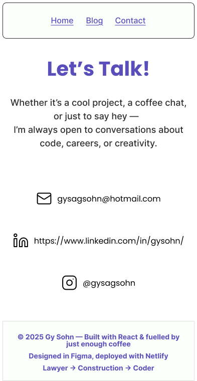
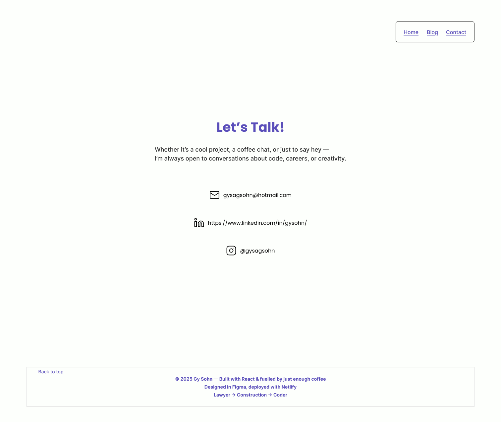
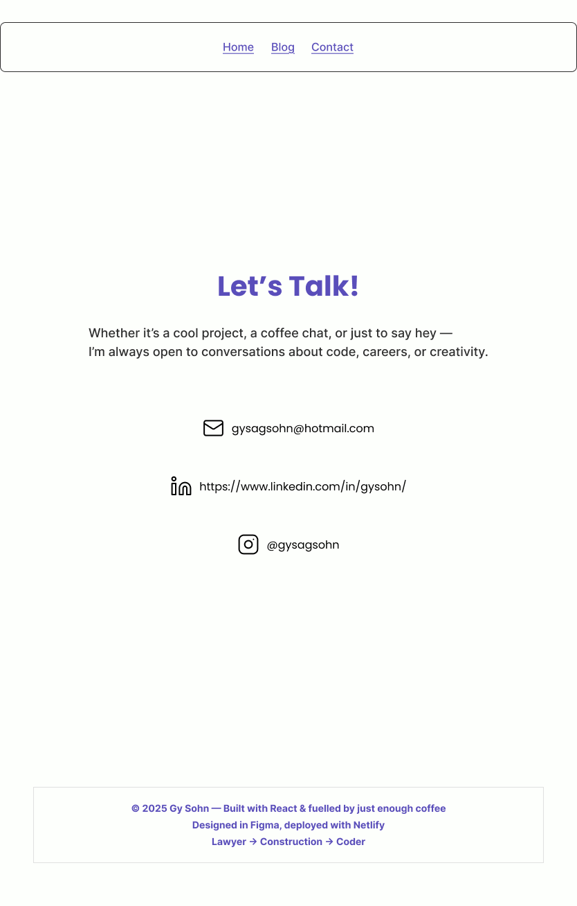

# Gy Sohn – Portfolio Website (v2)

Welcome to the version 2 of my personal developer portfolio website. This project is a ground-up rebuild focused on improving visual design, interactivity, and showcasing my growth as a full-stack developer. This site is a fully client-rendered React SPA using React Router, modular components, and a global theme layer built in CSS.

## Live Site
You can visit the live version of this portfolio at
🌐 https://gysohn.com/

Heads up: it’s still under construction — kind of like a dev site with a hard hat on. Improvements are ongoing, so things may look half-painted (intentionally).

## Project Purpose

The goal of this portfolio is to:
- Present my technical skills and personal projects.
- Share a short bio and my career transition journey.
- Create an interactive, well-designed digital space that reflects who I am as a developer.
- Optionally include a blog or insights section in the future.

## My First-Ever Portfolio Website
Built with just HTML and CSS, this was my introduction to web dev—and my attempt to make Comic Sans cool again (don’t worry, I didn’t actually use it).

Live Site (v1) (https://gysohn-v1.netlify.app/)
Source Code (https://github.com/gysagsohn/gysohn_T1A2)

It’s simple, nostalgic, and a reminder of how far things have come (and how many divs I’ve closed since).

---

## Design & Inspiration

This portfolio draws inspiration from several developer portfolios and templates, combining the best of each to reflect my own style:

- **[DeveloperFolio](https://developerfolio.js.org/)** – Functionality, React structure, and customisability.
- **[Josh Comeau](https://www.joshwcomeau.com/)** – Interactivity, playful design, and narrative-driven content.
- **[Brittany Chiang](https://v4.brittanychiang.com/)** – Layout structure and clean professional aesthetic.
- **[Harnish Design – Callum Template](https://harnishdesign.net/demo/react/callum/demo/)** – Full-screen menu, transitions, and skill display features.

---

## Tech Stack

Planned tools and technologies:
- **React (Vite or CRA)**
- **CSS Modules or Tailwind CSS**
- **React Router**
- **Netlify or Vercel** for deployment
- **Optional:** Animation libraries (Framer Motion / AOS), custom cursor, blog markdown setup

---

## 🔧 Features
- Fully responsive layout (mobile-first)
- Global theming using CSS variables
- Clean typography and consistent spacing system
- Modular component structure with React
- Planned blog integration (Markdown or JSX)
- Styled buttons and interactive hover states
- Dynamic city detection using IP (via `ipapi.co`)
- Fun animated wave icon next to the greeting
- Social icon links (email, LinkedIn, Instagram)

## Colour Scheme

I've implemented a global theme using CSS variables. Here's the palette currently in use:



```css
:root {
  --background-colour: #FDFFFC;     /* Ivory White */
  --text-primary: #2E2E2E;          /* Charcoal Soft Black */
  --text-secondary: #5A4EBA;        /* Indigo Light */
  --accent-button: #FFB20F;         /* Amber Gold */
  --hover-colour: #B5A9E9;          /* Soft Purple */
  --font-family: 'Inter', sans-serif;
}
```

## ✍️ Typography & Spacing System

I'm using a custom typography and spacing system based on a 4px scale and Google Fonts for better consistency and control across the layout.

### Fonts
- **Headings:** Poppins (600–700 weight)
- **Body Text:** Inter (400 weight)

### Type Scale
| Element     | Size     |
|-------------|----------|
| H1          | 36–48px  |
| H2          | 28–32px  |
| H3          | 22–24px  |
| Body        | 16–18px  |
| Small Text  | 14px     |

- **Letter Spacing (Headings):** 0.5px  
- **Line Height:** 1.2 (headings), 1.5 (body)

### Spacing (4px System)
```css
--space-xs: 4px;
--space-sm: 8px;
--space-md: 16px;
--space-lg: 32px;
--space-xl: 64px;
```

## Project Structure (planned)

```txt
src/
├── assets/
├── components/
├── pages/
├── styles/
├── utils/
└── App.jsx

```

## Planned Content

### 1. Hero Section
- Bold tagline: *“Ok! Let's do this”*
- Static intro line: *“Hi, I'm a Full Stack Developer”*
- Typing animation featuring phrases like:
  - "I'm Gy Sohn"
  - "Based in Sydney"
  - "React, Node & Beyond"
  - "Let’s build something cool"
  - "Ex-Lawyer Turned Coder"
- IP-based city greeting (e.g. “You’re visiting from Brisbane”)
- Clean buttons for work/contact

### 2. Blog Page
- Overview of my career: Law → Construction → Software
- Thoughts on motivation, learning, and project work
- Personal touch: photo or fun fact
- Deeper dive into key projects

### 3. Contact
- Email, LinkedIn, Instagram (also shown in footer)
- Possibly a contact form or message area

### 4. 404 Page
- Humorous "Internal Hellfire – Error 666" custom page for unmatched routes

### Button Styles

#### Primary Button

- **Background:** `#FFB20F` (Amber Gold)  
- **Text Colour:** `#2E2E2E` (Charcoal)  
- **Hover State:** `#B5A9E9` (Soft Purple)  
- **Padding:** 12px 24px  
- **Border Radius:** 8px  
- **Font:** 16px, Bold  

#### Secondary Button

- **Background:** `#FDFFFC` (Ivory)  
- **Text Colour:** `#5A4EBA` (Indigo)  
- **Border:** `1px solid #5A4EBA`  
- **Hover State:** Text colour changes to `#B5A9E9`  
- **Font:** 16px, Regular  
- **Padding:** 12px 24px  

#### Disabled Button

- **Background:** `#E0E0E0`  
- **Text Colour:** `#A0A0A0`  
- **Cursor:** `not-allowed`  

#### Transitions

- **Hover:** `all 0.2s ease-in-out`  
- **Active:** `transform: scale(0.98)`  

## 📐 Wireframes

Wireframes created in Figma to guide responsive layout:

#### Homepage (All Devices)
- 
- 
- 

#### Blog Page
- 
- 
- 

#### Contact Page
- 
- 
- 
---

## 🖱 Hover / Interactive Behaviour (To Code)

### Global Navigation
- On hover:
  - Text: `#5A4EBA → #B5A9E9` with fade transition
  - Underline appears (`transition: all 0.2s ease`)
- “Back to Top” scrolls smoothly to the top

### Homepage

#### Blog + Project Cards
- `transform: scale(1.03)`
- Slight darken background on hover
- Box shadow: `0px 4px 10px rgba(90, 78, 186, 0.1)`

#### Skills Grid
- Tooltip with technology label
- Light border or subtle shadow highlight

#### Timeline Scroll Box (Mobile)
- Enable vertical scroll: `overflow-y: scroll`
- Optional: `scroll-snap-type: y mandatory`

### Blog Page

#### Filter Tabs
- On hover:
  - Text: white
  - Background: `#B5A9E9`
- On click (active):
  - Animate underline with `transform: scaleX(1)`
  - Transition: `0.3s background, 0.3s color`

#### Blog Grid Cards
- Title + description fade in on hover
- Background tint overlay
- `cursor: pointer`

### Contact Page

#### Icon Links
- Hover:
  - `transform: scale(1.05)`
  - Colour fades Indigo → Soft Purple
  - Underline text
- Click:
  - `mailto:` for email
  - `target="_blank"` for LinkedIn and Instagram

### Footer
- “Back to Top”:
  - Hover: Indigo → Gold
  - `cursor: pointer`

---

## 🎨 Bold Card Styling Idea (Experimental)

An optional enhancement idea for visual punch:

- Use bold colour fills instead of light outlines
- Remove borders and use shadows + spacing
- On hover:
  - `filter: brightness(1.05)`
  - Slight background lift using `transform: translateY(-2px)`
  - `mix-blend-mode: screen` (optional for glow-like effect)
- Consider using this style for:
  - Blog/Project cards
  - Timeline entries
  - Contact buttons

## Development Plan

### Completed

- ✅ Set up Vite + React project
- ✅ Created and structured routes with React Router (Home, Blog, Contact)
- ✅ Designed reusable Header and Footer components
- ✅ Built global theming system using `theme.css` (colour palette, font stack, spacing)
- ✅ Created reusable button components and styles
- ✅ Implemented typography and spacing system using CSS variables
- ✅ Integrated city detection using `ipapi.co`
- ✅ Added SEO meta tags and Open Graph previews
- ✅ Styled the homepage with responsive layout and component-based sections
- ✅ Deployed site to Netlify
- ✅ Set up `404` custom page with humour-driven messaging
- ✅ Created a **terminal-style code animation** in the Hero section:
- ✅ Styled to mimic VS Code with syntax-highlighted tokens (`const`, `string`, `method`)
- ✅ Fades each line in with typing animation and blinking cursor
- ✅ Uses `react-simple-typewriter` with `renderText` for full JSX control
- ✅ Loop resets for continuous animation
- ✅ Idea credit: **Ben** — thanks for the inspiration!

- ✅ Built the **Contact Page**:
  - Minimal, theme-aligned layout with:
    - Click-to-open social links (`mailto`, LinkedIn, Instagram)
    - Copy-to-clipboard with animated checkmark ✅
    - Keyboard accessible (`tabIndex`, `Enter` key support)
    - Leveraging shared `socialLinks.js` data for easy reuse and updates

- ✅ Added logo and dark mode toggle to header:
  - Logo (`~GySohn`) links to home
  - Toggle persists theme in `localStorage` and updates DOM class (`dark`)
  - Colour logic to be styled later (dark hover/focus effects planned)

- ✅ README upgraded with:
  - Full feature documentation
  - Code animation breakdown
  - Notes on alternate `Typewriter` styles (multi-line greeting variant)

### In Progress / Next

- [ ] Finalise visual styling for dark mode theme
- [ ] Blog page layout and project post content
- [ ] Blog cards with filters and tag system
- [ ] Add scroll-based animation using AOS or Framer Motion
- [ ] Mobile-first audit and UI polish
- [ ] Write blog post about the terminal animation process
- [ ] Add markdown rendering and routing for blog posts

## 🚀 Live Demo

Coming soon – will be deployed to [Netlify](gysohn.com)

---

## Notes to Self

- Add credit line:  
  "Loosely designed in Figma and coded in Visual Studio Code by yours truly. Built with React and deployed with Netlify. Typeface: Inter."

- Save the retro link/TARDIS easter egg idea for version 2.1
- Consider blog posts as markdown or hardcoded components for now

## 🧠 Terminal-Style Typing Animation (Hero Section)

The hero section now features a custom-built **code-style typing animation**, mimicking a VS Code terminal experience. Each line is:

- Displayed line-by-line with a simulated typing effect
- Highlighted using syntax-coloured spans for keywords, strings, and methods
- Styled with a dark terminal background and a blinking cursor at the end

💡 **This idea was inspired by a conversation with [Ben]**, who suggested making the hero section look like you're actively coding. It's since become one of the defining interactive elements of the site. Thanks, Ben!

---

## 🧪 Past Experiments

Before building the terminal-style code animation, I originally used [`react-simple-typewriter`](https://www.npmjs.com/package/react-simple-typewriter) with pre-defined phrases like:

```js
"I'm Gy Sohn"
"Based in Sydney"
"React, Node & Beyond"
"Ex-Lawyer Turned Coder"

```
Although I moved away from that for the hero section, I still plan to reuse that style elsewhere in future projects (e.g. blog intros, testimonial banners, or contact animations).